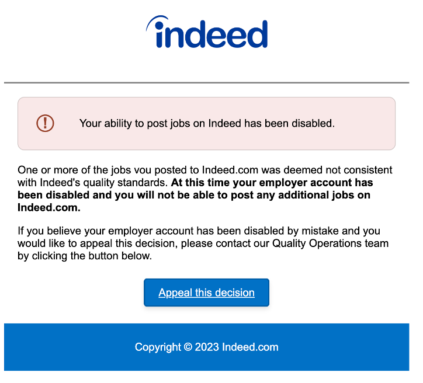
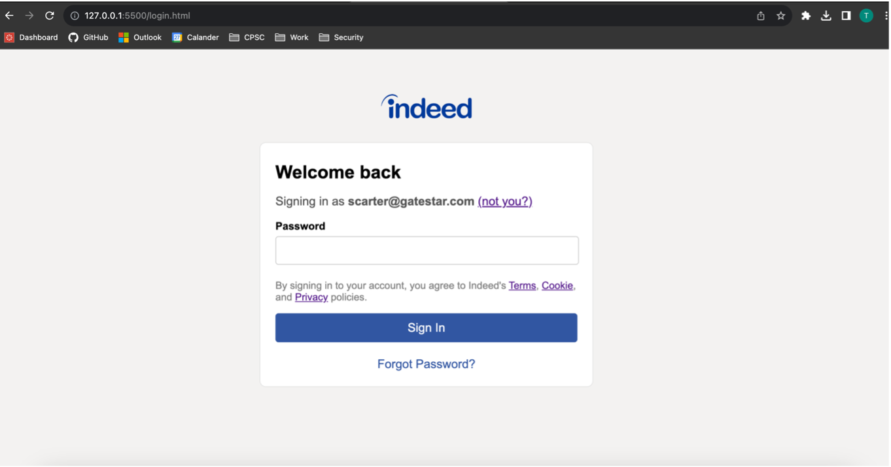

# PhishingExercise
A phishing site I created for a Information Security & Policy assignment.

## Email
The following is a sample phishing email for Samantha Carter, a fake person who is the CEO of Gatesatar, a high end security gate and door company.
Her company is growing rapidly and she is in desperate need of staff, so I created a sample phishing email that her hiring portal was shut down.  

## Landing Page
The landing page already has Sarah Carter's email filled in, meaning it won't be suspicous that her password autofiller doesn't work. 

## Backend
The landing page sends POST request to a backened server waiting for a request that quickly logs the password to a text file. If I was to create a wider phishing campaign, I would instead write to a MySQL database. 

## Demo
This is a demo video of the phishing site in action
(https://youtu.be/bd6uhxib7mY)
